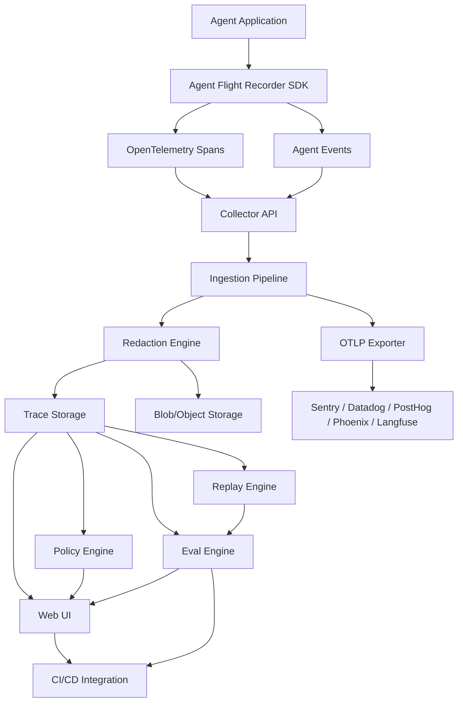
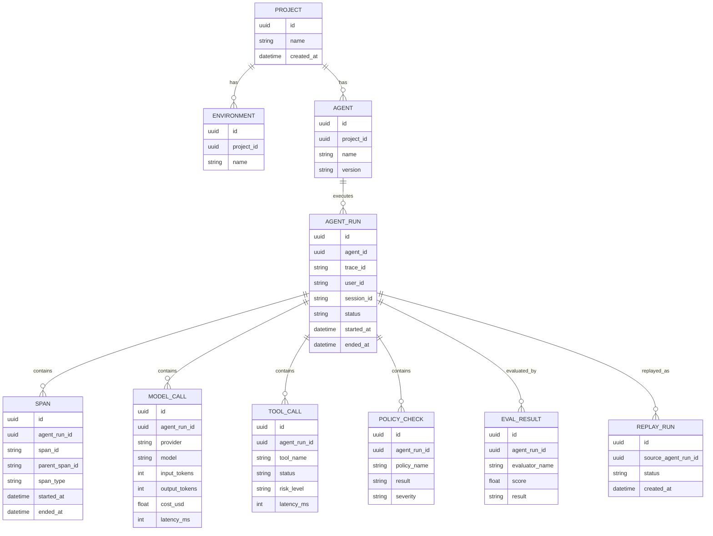
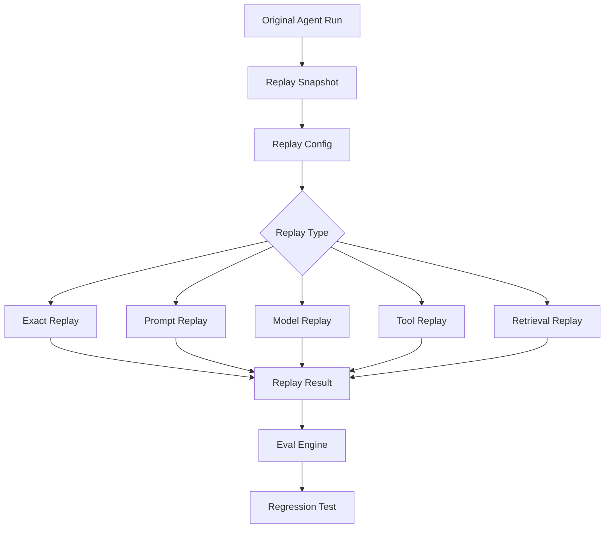

# ADR-001: Build an OpenTelemetry-Native Agent Flight Recorder

## Status

Accepted

## Date

2026-06-15

## Owner

<Your Name / Team>

## Decision Type

Architecture / Product / Platform

## Related Decisions

- ADR-002: Storage Strategy for Agent Traces and Replay Data
- ADR-003: Redaction and Privacy Model for Prompt/Response Logging
- ADR-004: Evaluation and Regression Testing Strategy
- ADR-005: Open Source Core vs. Commercial Cloud Boundary

---

## 1. Context

Enterprises are beginning to experiment with AI agents that can use tools, call APIs, access internal systems, retrieve documents, update records, send messages, and make semi-autonomous decisions.

However, most teams still lack confidence in deploying agents into production-critical workflows because agent behavior is difficult to inspect, reproduce, evaluate, and govern.

Traditional application observability tools can answer questions like:

- Did the API return 200 or 500?
- How long did the request take?
- Which service threw an error?
- What was the CPU, memory, or database latency?

But AI agents introduce new failure modes:

- The agent chose the wrong tool.
- The agent called the right tool with the wrong arguments.
- The agent hallucinated a reason for taking an action.
- The agent exposed sensitive user or company data.
- The agent got stuck in a loop.
- The agent used an expensive model unnecessarily.
- The agent ignored business policy.
- The agent was manipulated through prompt injection.
- The agent produced an answer that looked correct but was factually wrong.
- The agent behaved differently after a prompt, model, tool, or retrieval change.

Existing LLM observability platforms provide tracing, prompt logging, cost tracking, and evaluation features. However, there is still a meaningful opportunity for an open-source, developer-first tool focused specifically on **agent reliability evidence**:

> Capture production agent behavior, replay it, turn failures into regression tests, evaluate changes, and provide an auditable record of every agent decision and tool call.

This ADR defines the architecture for an open-source project tentatively named:

### Agent Flight Recorder

---

## 2. Problem Statement

We need to design a system that allows developers and enterprises to monitor, debug, replay, evaluate, and audit AI agent behavior across multiple frameworks and model providers.

The system should help answer:

- What did the agent do?
- Why did it do that?
- Which model, prompt, tools, and context were involved?
- Which user or workflow was affected?
- Did the agent violate policy?
- Can we replay the failure?
- Can we convert the failure into a regression test?
- Did a new prompt, model, tool, or retrieval change improve or degrade behavior?
- Can we export traces into existing observability platforms?

The product should not merely be another tracing dashboard. It should focus on the full reliability loop:

```text
Production trace
   -> failure investigation
   -> replay
   -> eval
   -> regression test
   -> CI gate
   -> audit trail
````

---

## 3. Decision

We will build an **OpenTelemetry-native Agent Flight Recorder**.

The system will provide:

1. SDKs for Python and TypeScript agent applications.
2. OpenTelemetry-compatible trace collection.
3. Agent-specific event modeling for model calls, tool calls, memory operations, retrieval steps, human approvals, policy checks, and final outputs.
4. Local-first development mode using SQLite.
5. Production deployment mode using Postgres and ClickHouse.
6. Replay engine for reproducing previous agent runs.
7. Eval engine for scoring replayed or production traces.
8. Policy engine for detecting risky or forbidden agent behavior.
9. Web UI for trace inspection, replay, evals, and audit.
10. Exporters to existing tools such as PostHog, Sentry, Datadog, Langfuse, Phoenix, and generic OTLP backends.

The core product will be open source. Commercial opportunities may later exist around hosted deployment, team collaboration, RBAC, long-term retention, compliance, and enterprise governance.

---

## 4. Goals

### 4.1 Product Goals

The product should help developers and enterprises:

* Understand agent behavior at the step-by-step level.
* Debug production failures.
* Replay previous agent runs.
* Convert failures into regression tests.
* Evaluate new prompts, models, tools, and retrieval strategies.
* Detect policy violations and unsafe tool usage.
* Maintain an auditable record of agent actions.
* Integrate with existing observability and analytics tools.

### 4.2 Technical Goals

The architecture should be:

* OpenTelemetry-native.
* Framework-agnostic.
* Model-provider-agnostic.
* Easy to self-host.
* Easy to run locally.
* Extensible through plugins.
* Safe by default for sensitive data.
* Suitable for high-volume trace ingestion.
* Compatible with existing observability stacks.

### 4.3 Developer Experience Goals

A developer should be able to install and use the tool in less than five minutes.

Example target experience:

```python
from agent_flight_recorder import recorder

recorder.init(
    app_name="support-agent",
    environment="development"
)

with recorder.agent_run(name="refund-agent", user_id="user_123") as run:
    result = agent.invoke("Refund my latest order")
```

Or in TypeScript:

```ts
import { recorder } from "@agent-flight-recorder/node";

recorder.init({
  appName: "support-agent",
  environment: "development",
});

await recorder.agentRun(
  {
    name: "refund-agent",
    userId: "user_123",
  },
  async () => {
    return await agent.invoke("Refund my latest order");
  }
);
```

---

## 5. Non-Goals

This project will not initially attempt to be:

* A general-purpose APM replacement.
* A full product analytics platform.
* A generic business intelligence tool.
* A model hosting platform.
* A prompt marketplace.
* A vector database.
* A complete AI security platform.
* A complete governance, risk, and compliance platform.
* A no-code agent builder.
* A replacement for LangChain, LangGraph, CrewAI, OpenAI Agents SDK, or similar frameworks.

The initial focus is narrow:

> Trace, replay, evaluate, and audit agent behavior.

---

## 6. Key Definitions

### Agent Run

A single execution of an AI agent workflow from user input or system trigger to final outcome.

Example:

```text
User asks support agent to refund an order.
Agent retrieves customer data.
Agent checks order history.
Agent calls refund API.
Agent sends confirmation email.
Agent returns final message.
```

### Model Call

A call to an LLM or other AI model.

Captured fields may include:

* Provider
* Model
* Prompt
* System prompt
* Input messages
* Output
* Token usage
* Cost
* Latency
* Temperature
* Tool/function definitions
* Error metadata

### Tool Call

An action taken by the agent against an external function, API, connector, MCP server, database, or internal system.

Captured fields may include:

* Tool name
* Tool provider
* Input arguments
* Output/result
* Error
* Latency
* Permission scope
* Risk classification
* Approval status

### Replay

The act of re-executing a previous agent run, or selected parts of it, using the same or modified inputs, prompts, tools, model, or retrieval context.

### Eval

A structured assessment of an agent output or trace.

Examples:

* Did the agent answer correctly?
* Did the agent use the right tool?
* Did the agent follow policy?
* Did the agent expose sensitive data?
* Did the agent hallucinate unsupported claims?
* Did the agent complete the task successfully?

### Policy Check

A rule-based or model-assisted check that determines whether an agent action is allowed, risky, or forbidden.

Examples:

* Agent cannot issue refunds above $500 without approval.
* Agent cannot email external recipients with internal-only documents.
* Agent cannot call production database write tools in dry-run mode.
* Agent cannot reveal API keys, passwords, or private notes.

---

## 7. Architecture Overview

### 7.1 High-Level Architecture



---

## 8. Core Architectural Decision

We will use **OpenTelemetry as the base observability protocol**, while adding an agent-specific semantic layer.

### 8.1 Rationale

OpenTelemetry gives us:

* Existing instrumentation patterns.
* Existing collectors.
* Existing backend compatibility.
* Existing ecosystem support.
* Vendor neutrality.
* Familiar concepts such as traces, spans, attributes, and events.

However, raw OpenTelemetry is not enough for agent reliability. Therefore, we will define an agent-specific schema on top of OpenTelemetry.

Example span types:

```text
agent.run
agent.step
llm.call
tool.call
retrieval.query
memory.read
memory.write
policy.check
human.approval
eval.run
replay.run
```

This allows compatibility with existing observability tools while still giving Agent Flight Recorder enough semantic detail to support replay, evals, policy checks, and audit trails.

---

## 9. Components

### 9.1 SDKs

We will provide official SDKs for:

* Python
* TypeScript / Node.js

The SDKs will be responsible for:

* Creating traces and spans.
* Capturing agent runs.
* Capturing model calls.
* Capturing tool calls.
* Capturing retrieval calls.
* Capturing memory reads/writes.
* Capturing errors.
* Capturing cost and latency.
* Capturing metadata such as user ID, session ID, environment, deployment version, and agent version.
* Sending data to the local or hosted collector.

#### SDK Requirements

The SDK must support:

* Manual instrumentation.
* Auto-instrumentation where possible.
* OpenTelemetry-compatible span creation.
* Local buffering.
* Retry on failure.
* Configurable redaction.
* Sampling.
* Environment-based configuration.

Example environment variables:

```bash
AFR_API_KEY=
AFR_ENDPOINT=http://localhost:4318
AFR_ENVIRONMENT=development
AFR_CAPTURE_PROMPTS=true
AFR_CAPTURE_RESPONSES=true
AFR_REDACTION_MODE=strict
```

---

### 9.2 Collector API

The collector receives traces and events from SDKs.

Responsibilities:

* Accept OTLP-compatible telemetry.
* Accept Agent Flight Recorder native events.
* Validate schemas.
* Normalize provider-specific payloads.
* Run redaction before storage.
* Assign trace IDs and run IDs when missing.
* Route data to storage.
* Route data to exporters.
* Support local and production deployment.

The collector should expose:

```text
POST /v1/traces
POST /v1/events
POST /v1/replays
POST /v1/evals
GET  /health
```

For OpenTelemetry compatibility, it should also support OTLP HTTP ingestion.

---

### 9.3 Ingestion Pipeline

The ingestion pipeline processes incoming data before persistence.

Pipeline stages:

```text
Receive
  -> validate
  -> normalize
  -> enrich
  -> redact
  -> classify risk
  -> store
  -> export
```

#### Enrichment Examples

The ingestion pipeline may enrich traces with:

* Model cost estimate.
* Token usage estimate.
* Tool risk level.
* Deployment version.
* Agent version.
* Git commit SHA.
* Environment.
* User/session metadata.
* Error classification.
* Latency breakdown.

---

### 9.4 Redaction Engine

The redaction engine is mandatory because traces may contain sensitive information.

It should support:

* Email redaction.
* Phone number redaction.
* Credit card redaction.
* API key redaction.
* Secret/token redaction.
* Custom regex-based redaction.
* Field-level allowlists.
* Field-level blocklists.
* Hashing instead of full deletion.
* Local-only redaction before network transmission.

Example configuration:

```yaml
redaction:
  mode: strict
  redact_prompts: false
  redact_responses: false
  patterns:
    - name: email
      action: mask
    - name: credit_card
      action: remove
    - name: api_key
      action: remove
  custom_patterns:
    - name: internal_customer_id
      regex: "cust_[a-zA-Z0-9]+"
      action: hash
```

---

### 9.5 Storage

We will support two storage modes.

#### Local Development Mode

Use SQLite.

Purpose:

* Fast local setup.
* Easy demos.
* No infrastructure dependency.
* Good developer experience.

#### Production Mode

Use:

* Postgres for relational metadata.
* ClickHouse for high-volume trace and event data.
* Object storage for large payloads.

#### Storage Responsibilities

Postgres stores:

* Projects
* Environments
* Users
* API keys
* Agents
* Eval definitions
* Policy definitions
* Replay jobs
* Dataset metadata
* Access control metadata

ClickHouse stores:

* Spans
* Events
* Model calls
* Tool calls
* Token usage
* Cost metrics
* Latency metrics
* Error metrics

Object storage stores:

* Large prompts
* Large responses
* Tool payloads
* Attachments
* Replay snapshots

---

## 10. Data Model

### 10.1 Core Entities



---

### 10.2 Agent Run Schema

```json
{
  "id": "run_123",
  "trace_id": "trace_abc",
  "project_id": "proj_123",
  "environment": "production",
  "agent": {
    "name": "refund-agent",
    "version": "2026.06.15"
  },
  "user": {
    "id": "user_123",
    "session_id": "session_456"
  },
  "input": {
    "type": "chat",
    "content_ref": "blob://input/run_123"
  },
  "output": {
    "type": "chat",
    "content_ref": "blob://output/run_123"
  },
  "status": "success",
  "started_at": "2026-06-15T10:00:00Z",
  "ended_at": "2026-06-15T10:00:05Z",
  "metrics": {
    "latency_ms": 5000,
    "input_tokens": 1200,
    "output_tokens": 450,
    "cost_usd": 0.018
  },
  "risk": {
    "max_risk_level": "medium",
    "policy_violations": 0
  }
}
```

---

### 10.3 Tool Call Schema

```json
{
  "id": "tool_call_123",
  "agent_run_id": "run_123",
  "span_id": "span_456",
  "tool_name": "refund_payment",
  "tool_provider": "internal_payments_api",
  "tool_type": "http_api",
  "arguments_ref": "blob://tool_args/tool_call_123",
  "result_ref": "blob://tool_results/tool_call_123",
  "status": "success",
  "latency_ms": 850,
  "risk_level": "high",
  "approval": {
    "required": true,
    "status": "approved",
    "approved_by": "manager_123"
  },
  "started_at": "2026-06-15T10:00:03Z",
  "ended_at": "2026-06-15T10:00:04Z"
}
```

---

## 11. Agent Event Taxonomy

The system will classify events using a consistent taxonomy.

### 11.1 Event Types

```text
agent.run.started
agent.run.completed
agent.run.failed

agent.step.started
agent.step.completed
agent.step.failed

llm.call.started
llm.call.completed
llm.call.failed

tool.call.started
tool.call.completed
tool.call.failed

retrieval.query.started
retrieval.query.completed
retrieval.query.failed

memory.read
memory.write

policy.check.started
policy.check.completed
policy.check.failed

human.approval.requested
human.approval.granted
human.approval.denied

eval.run.started
eval.run.completed
eval.run.failed

replay.run.started
replay.run.completed
replay.run.failed
```

---

## 12. Replay Engine

### 12.1 Decision

We will build replay as a first-class product capability.

Replay should allow developers to take a previous production run and re-execute it under controlled conditions.

Replay modes:

1. **Exact replay**

   * Same input.
   * Same prompt.
   * Same model.
   * Same tool responses where possible.
   * Used for investigation.

2. **Prompt replay**

   * Same input and tool snapshots.
   * Different prompt.
   * Used for prompt iteration.

3. **Model replay**

   * Same input and prompt.
   * Different model.
   * Used for model comparison.

4. **Tool replay**

   * Same input and prompt.
   * Mocked or updated tool behavior.
   * Used for tool regression testing.

5. **Retrieval replay**

   * Same input.
   * Different retrieval configuration.
   * Used for RAG quality improvement.

### 12.2 Replay Design



### 12.3 Replay Snapshot

A replay snapshot should include:

* Original user input.
* System prompt.
* Developer prompt.
* Model configuration.
* Tool definitions.
* Tool responses.
* Retrieval results.
* Memory state.
* Relevant environment variables, when safe.
* Agent version.
* Application version.
* Timestamp.
* Redaction metadata.

Sensitive data must be redacted or encrypted according to project configuration.

---

## 13. Eval Engine

### 13.1 Decision

We will support both deterministic and model-assisted evaluations.

Eval types:

1. Rule-based evals.
2. LLM-as-judge evals.
3. Tool correctness evals.
4. Policy compliance evals.
5. Regression evals.
6. Human review evals.

### 13.2 Eval Examples

#### Tool Correctness Eval

```yaml
name: refund_tool_correctness
type: tool_correctness
rules:
  - tool_name: refund_payment
    must_only_be_called_when:
      - order_status == "delivered"
      - refund_amount <= 500
      - user_is_order_owner == true
```

#### Policy Compliance Eval

```yaml
name: no_private_notes_leak
type: policy
rules:
  - output_must_not_contain:
      - customer_internal_notes
      - admin_comments
      - fraud_score
```

#### Regression Eval

```yaml
name: refund_agent_regression
type: regression
dataset: production_refund_failures
pass_threshold: 0.9
evaluators:
  - refund_tool_correctness
  - no_private_notes_leak
  - final_answer_helpfulness
```

---

## 14. Policy Engine

### 14.1 Decision

We will include a lightweight policy engine in the open-source core.

The policy engine should detect:

* Forbidden tool calls.
* Risky tool calls.
* Missing human approval.
* PII leakage.
* Secret leakage.
* Prompt injection indicators.
* Excessive tool loops.
* Excessive cost.
* Excessive latency.
* Unauthorized environment access.
* Suspicious MCP tool usage.

### 14.2 Policy Result Types

```text
allow
warn
block
require_approval
```

### 14.3 Example Policy

```yaml
name: require_approval_for_large_refunds
description: Refunds above 500 USD require human approval.
scope:
  agents:
    - refund-agent
rules:
  - when:
      tool_name: refund_payment
      arguments:
        amount_usd:
          greater_than: 500
    then:
      action: require_approval
      severity: high
```

---

## 15. User Interface

### 15.1 UI Goals

The UI should help developers quickly answer:

* What happened?
* Where did the agent go wrong?
* Which tool or model call caused the issue?
* How much did it cost?
* Was policy violated?
* Can I replay it?
* Can I turn this into a regression test?

### 15.2 Main Screens

#### Dashboard

Shows:

* Total agent runs.
* Failure rate.
* Policy violation rate.
* Average latency.
* Average cost.
* Token usage.
* Most expensive agents.
* Most common failed tools.
* Recent risky runs.

#### Trace Detail

Shows:

* Timeline of agent steps.
* Model calls.
* Tool calls.
* Retrieval calls.
* Memory operations.
* Human approvals.
* Errors.
* Policy checks.
* Cost breakdown.
* Latency breakdown.

#### Replay Screen

Shows:

* Original run.
* Replay configuration.
* Diff between original and replay.
* Eval result.
* Regression status.

#### Eval Screen

Shows:

* Eval definitions.
* Eval runs.
* Pass/fail history.
* Score trends.
* Failing examples.
* Linked traces.

#### Policy Screen

Shows:

* Active policies.
* Violations.
* Risk levels.
* Blocked actions.
* Approval events.

---

## 16. Integration Strategy

### 16.1 Supported Agent Frameworks

Initial integrations:

* OpenAI Agents SDK
* LangGraph
* Manual Python instrumentation
* Manual TypeScript instrumentation

Future integrations:

* LangChain
* CrewAI
* LlamaIndex
* Pydantic AI
* Vercel AI SDK
* AutoGen
* Semantic Kernel
* MCP servers and clients

### 16.2 Supported Model Providers

Initial support:

* OpenAI
* Anthropic
* Google Gemini
* Azure OpenAI
* Local OpenAI-compatible endpoints

Future support:

* AWS Bedrock
* Cohere
* Mistral
* Groq
* Together AI
* Fireworks
* Ollama
* vLLM

### 16.3 Export Targets

The system should export to:

* Generic OTLP endpoint
* Sentry
* Datadog
* PostHog
* Arize Phoenix
* Langfuse
* Grafana Tempo
* Jaeger

The product should not force teams to abandon their existing observability stack.

---

## 17. Security and Privacy

### 17.1 Security Requirements

The system must support:

* API key authentication.
* Project-level isolation.
* Environment separation.
* Secret redaction.
* PII redaction.
* Configurable data retention.
* Encryption in transit.
* Encryption at rest for hosted mode.
* Audit logs for administrative actions.
* Optional self-hosting.

### 17.2 Data Capture Modes

The SDK should support multiple capture modes.

```yaml
capture_mode: metadata_only
```

Captures:

* Trace IDs
* Span IDs
* Latency
* Cost
* Token usage
* Tool names
* Status
* Error types

Does not capture:

* Prompts
* Responses
* Tool arguments
* Tool results

```yaml
capture_mode: redacted
```

Captures prompt, response, and tool data after redaction.

```yaml
capture_mode: full
```

Captures full payloads. This should not be the default for production.

### 17.3 Default Privacy Position

Default production behavior should be:

```yaml
capture_mode: redacted
redaction_mode: strict
```

---

## 18. Scalability

### 18.1 Expected Scale

Initial open-source users may run:

* Hundreds to thousands of traces per day.
* Small teams.
* Local or single-node deployments.

Enterprise users may run:

* Millions of spans per day.
* High-volume customer support agents.
* Internal developer agents.
* Multiple environments.
* Long retention requirements.

### 18.2 Scaling Strategy

Use:

* Async ingestion.
* Batched writes.
* ClickHouse for event analytics.
* Object storage for large payloads.
* Sampling for high-volume traces.
* Retention policies.
* Background workers for replay and evals.

---

## 19. Technology Choices

### 19.1 Proposed Stack

#### SDKs

* Python SDK
* TypeScript / Node.js SDK
* OpenTelemetry libraries

#### Backend

* FastAPI or Node.js API service
* Background workers
* OTLP HTTP ingestion

#### Storage

Local mode:

* SQLite

Production mode:

* Postgres
* ClickHouse
* S3-compatible object storage

#### Frontend

* Next.js
* React
* Tailwind CSS
* TanStack Query
* Trace timeline visualization component

#### Deployment

* Docker Compose for local/self-hosted
* Helm chart for Kubernetes later
* Cloud-hosted option later

---

## 20. Alternatives Considered

### 20.1 Build a Generic LLM Observability Dashboard

#### Description

Build a dashboard for prompts, responses, token usage, cost, and latency.

#### Pros

* Easier to build.
* Clear existing market.
* Simple developer story.

#### Cons

* Highly crowded.
* Hard to differentiate.
* Existing tools already cover much of this.
* Does not fully address enterprise trust and agent reliability.

#### Decision

Rejected as the primary wedge.

We may include dashboard features, but the differentiated focus must be replay, evals, policy, and audit.

---

### 20.2 Build as a Plugin for Existing Tools

#### Description

Build an extension for Langfuse, Phoenix, PostHog, or Sentry instead of a standalone system.

#### Pros

* Easier distribution.
* Lower infrastructure burden.
* Can rely on existing storage and UI.

#### Cons

* Less control over product direction.
* Harder to build full replay and policy workflows.
* Harder to create a strong independent open-source brand.
* May become dependent on another platform’s roadmap.

#### Decision

Rejected for v1.

However, exporters and integrations with these tools are important.

---

### 20.3 Build a Full AI Governance Platform

#### Description

Build enterprise governance, compliance, policy management, risk scoring, approvals, and audit.

#### Pros

* Strong enterprise pain.
* Larger contract potential.
* Differentiated from simple observability.

#### Cons

* Too broad for an initial open-source project.
* Requires deep compliance workflows.
* Longer sales cycles.
* Harder to demonstrate quickly.

#### Decision

Rejected for v1.

We will build a lightweight policy and audit layer, but not a full governance platform initially.

---

### 20.4 Use Only OpenTelemetry Without Custom Schema

#### Description

Emit standard traces and let existing tools handle everything.

#### Pros

* Maximum compatibility.
* Less schema maintenance.
* Easier adoption.

#### Cons

* Generic spans do not capture agent semantics well.
* Replay and evals require richer structure.
* Tool-call governance requires agent-specific fields.
* Harder to build differentiated UX.

#### Decision

Rejected.

We will use OpenTelemetry as the base protocol but define an agent-specific semantic layer.

---

### 20.5 Store Everything in Postgres

#### Description

Use Postgres for all traces, spans, events, and payloads.

#### Pros

* Simpler architecture.
* Easy local development.
* Familiar to most developers.
* Good transactional support.

#### Cons

* Poorer fit for high-volume time-series/event analytics.
* Expensive at scale.
* Trace search and aggregation may become slow.

#### Decision

Partially accepted for early/simple deployments.

Postgres is acceptable for metadata and small deployments. Production event storage should use ClickHouse.

---

## 21. Consequences

### 21.1 Positive Consequences

* Strong differentiation from basic LLM observability tools.
* Clear developer value: debug, replay, and test agents.
* Clear enterprise value: audit, policy, and reliability evidence.
* OpenTelemetry compatibility reduces adoption friction.
* Local-first mode improves developer experience.
* Exporters allow teams to keep their existing observability stack.
* Replay and evals create a strong technical demo.
* The architecture supports both hiring credibility and startup potential.

### 21.2 Negative Consequences

* More complex than a simple dashboard.
* Replay is technically difficult because agent systems are often non-deterministic.
* Capturing sensitive data creates privacy and compliance risk.
* Supporting many frameworks may create maintenance burden.
* OpenTelemetry semantic conventions for AI agents may evolve, requiring schema updates.
* Enterprise-grade RBAC, SSO, and compliance features are out of scope initially but may become necessary.

### 21.3 Risks

| Risk                                        | Impact | Mitigation                                                          |
| ------------------------------------------- | -----: | ------------------------------------------------------------------- |
| Market is crowded                           |   High | Focus on replay, evals, policy, and audit instead of generic traces |
| Privacy concerns block adoption             |   High | Strict redaction defaults and self-hosting                          |
| Replay is unreliable                        | Medium | Support mocked tool responses and snapshot-based replay             |
| Framework integrations are hard to maintain | Medium | Start with manual instrumentation plus two official integrations    |
| Storage complexity slows development        | Medium | Start with SQLite, then add production storage                      |
| Developers do not understand the value      | Medium | Build strong demos showing real agent failures                      |
| Existing platforms copy the feature         | Medium | Move fast, stay open-source, focus on developer trust               |

---

## 22. MVP Scope

### 22.1 MVP Must Have

* Python SDK.
* TypeScript SDK.
* Manual instrumentation.
* OpenTelemetry-compatible trace generation.
* Local collector.
* SQLite storage.
* Trace timeline UI.
* Model call capture.
* Tool call capture.
* Cost and latency tracking.
* Error tracking.
* Basic redaction.
* Replay from stored trace.
* Manual eval definition.
* Convert trace into regression test.
* Docker Compose setup.
* Demo support agent.

### 22.2 MVP Should Have

* OpenAI Agents SDK integration.
* LangGraph integration.
* OTLP export.
* Basic policy checks.
* Prompt/model replay comparison.
* JSON/YAML eval configuration.
* GitHub Actions example for regression tests.

### 22.3 MVP Could Have

* ClickHouse storage.
* Postgres storage.
* Hosted cloud.
* Team accounts.
* SSO.
* RBAC.
* Slack alerts.
* Jira integration.
* Advanced PII detection.
* MCP-specific governance.
* LLM-as-judge evals.

### 22.4 MVP Will Not Have

* Full enterprise compliance workflows.
* Multi-region deployment.
* Full SOC 2 readiness.
* Complete no-code policy builder.
* Built-in agent builder.
* Vector database.
* Long-term hosted retention.

---

## 23. Example User Flow

### 23.1 Debugging a Production Agent Failure

1. Support agent refunds the wrong customer order.
2. Developer opens Agent Flight Recorder.
3. Developer searches by user ID or trace ID.
4. Developer opens the failed agent run.
5. UI shows the full timeline:

   * User message.
   * Retrieval query.
   * Model reasoning summary.
   * Tool call to `get_orders`.
   * Tool call to `refund_payment`.
   * Final response.
6. Developer sees that the agent selected the wrong order ID.
7. Developer clicks `Create Regression Test`.
8. System creates a test case from the trace.
9. Developer modifies the prompt/tool validation logic.
10. Developer runs replay.
11. Eval passes.
12. Regression test is added to CI.

---

## 24. Example Repository Structure

```text
agent-flight-recorder/
  apps/
    web/
      src/
      package.json
    collector/
      src/
      package.json
  packages/
    sdk-js/
      src/
      package.json
    sdk-python/
      agent_flight_recorder/
      pyproject.toml
    shared-schema/
      schemas/
      package.json
  examples/
    support-refund-agent/
    research-agent/
    mcp-tool-agent/
  infra/
    docker-compose.yml
    clickhouse/
    postgres/
  docs/
    quickstart.md
    architecture.md
    replay.md
    evals.md
    policies.md
  adr/
    ADR-001-agent-flight-recorder.md
```

---

## 25. Open Source Strategy

### 25.1 Open Source Core

The open-source version should include:

* SDKs.
* Local collector.
* Local UI.
* SQLite storage.
* Trace viewer.
* Replay.
* Basic evals.
* Basic policy checks.
* Exporters.
* Docker Compose deployment.

### 25.2 Future Commercial Features

Potential paid features:

* Hosted cloud.
* Team collaboration.
* SSO/SAML.
* RBAC.
* Long-term retention.
* Advanced audit logs.
* Compliance exports.
* Advanced PII controls.
* Enterprise policy packs.
* High-scale ClickHouse deployment.
* Managed eval workers.
* Slack/Jira/GitHub integrations.
* Approval workflows.
* Private cloud deployment.

---

## 26. Success Metrics

### 26.1 Developer Adoption Metrics

* GitHub stars.
* Weekly active projects.
* SDK installs.
* Number of traces captured.
* Number of replay runs.
* Number of evals created.
* Number of regression tests generated.
* Number of self-hosted deployments.

### 26.2 Product Quality Metrics

* Time to first trace.
* Time to first replay.
* Time to first regression test.
* Percentage of traces successfully ingested.
* Replay success rate.
* Eval execution success rate.
* SDK overhead.
* Collector ingestion latency.

### 26.3 Business Validation Metrics

* Inbound demo requests.
* Companies self-hosting.
* GitHub issues from real teams.
* Community integrations.
* Requests for SSO/RBAC/compliance.
* Requests for hosted cloud.
* Requests for enterprise support.

---

## 27. Implementation Plan

## Phase 1: Local Trace Capture

**Status: Complete** (2026-06-16)

Built:

* Python SDK with OTLP export, cost/latency metrics, and redaction.
* TypeScript SDK with OTLP export.
* Local collector (FastAPI) with OTLP ingest, search, replay stub, and eval runner.
* SQLite schema including `replay_snapshots`, `replay_runs`, and `eval_results`.
* Trace timeline UI with cost, latency, search, errors, replay, and eval actions.
* Demo support-refund agent.
* `make e2e` end-to-end verification script.

Exit criteria (met):

* Developer can capture an agent run locally.
* Developer can inspect model calls and tool calls with cost and latency.
* Search by `user_id` and `trace_id`.
* Basic redaction masks emails and removes API keys.
* Exact replay creates a `replay_run` from a stored trace.
* `tool_correctness` eval passes on the demo trace.
* Regression test YAML exports from a run.
* Setup works through Docker Compose and `make setup`.

---

## Phase 2: Replay and Regression Tests

**Status: Complete** (2026-06-16)

Built:

* Replay snapshot format (v1 JSON schema).
* Replay runner with `exact` and `model` modes.
* Trace-to-regression-test export (`GET /v1/runs/{id}/regression-test`, `afr export regression`).
* Regression eval runner (`tool_correctness` suites with `pass_threshold`).
* `afr` CLI (`packages/cli`): `replay`, `eval run`, `test`, `export regression`.
* `make test` + `.github/workflows/regression.yml` CI gate.

Example CLI:

```bash
afr replay run_123 --model gpt-4.1-mini
afr eval run regression_refund_agent.yml
afr test ./afr-tests/
```

Exit criteria (met):

* Developer can turn a production-like trace into a regression test.
* CI fails when an eval score drops below threshold (`afr test`, exit code 1).

---

## Phase 3: Policy and Risk Layer

**Status: Complete** (2026-06-16)

Built:

* Policy YAML format (`examples/policies/`, `packages/shared-schema/schemas/policy.json`).
* Policy engine on OTLP ingest (`collector/policy.py`) with `allow`, `warn`, `block`, `require_approval`.
* Tool risk classification (`collector/risk.py`) stored on `tool_calls.risk_level`.
* PII/secret detection in model outputs (reuses redaction patterns).
* Policy violation UI (`PolicyViolations`, `/policies` page, risk badges on tool calls).
* Human approval span tracking (`human.approval` spans, `approval_events` table, SDK `human_approval()`).
* APIs: `GET/POST /v1/policies`, `GET /v1/violations`, `GET /v1/runs/{id}/violations`, `POST /v1/runs/{id}/policy-check`.
* CLI: `afr policy list|load|check`. `make policy-test` verification script.

Exit criteria (met):

* Developer can define a policy in YAML.
* System detects a risky or forbidden tool call (demo: `policy_violation.py`).
* UI clearly shows policy violations on run detail and policies dashboard.

---

## Phase 4: Production Storage and Exporters

**Status: Complete** (2026-06-16)

Built:

* Postgres storage backend (`AFR_STORAGE_BACKEND=postgres`, `infra/postgres/schema.sql`).
* ClickHouse analytics writer (`span_events` table, async ingest).
* S3-compatible object storage for large payloads (MinIO in prod compose).
* OTLP forward exporter (`AFR_OTLP_EXPORT_ENDPOINT`, Langfuse, Phoenix env vars).
* `infra/docker-compose.prod.yml` production stack.
* `make prod-up`, `make storage-test`, `GET /v1/storage`.

Exit criteria (met):

* System can handle higher-volume trace ingestion (ClickHouse + blob offload).
* Teams can send traces to existing observability tools via OTLP forward.

---

## 28. Final Decision Summary

We will build Agent Flight Recorder as an open-source, OpenTelemetry-native reliability platform for AI agents.

The product will not compete primarily as a generic LLM observability dashboard. Instead, it will focus on the reliability workflow enterprises need before trusting agents with meaningful autonomy:

```text
trace -> replay -> eval -> regression test -> policy check -> audit trail
```

The key architectural bet is:

> OpenTelemetry should be the compatibility layer, but agent-specific replay, evaluation, policy, and audit semantics should be the differentiation layer.

This gives the project a strong open-source wedge, a credible developer experience, and a path toward enterprise value.

```
