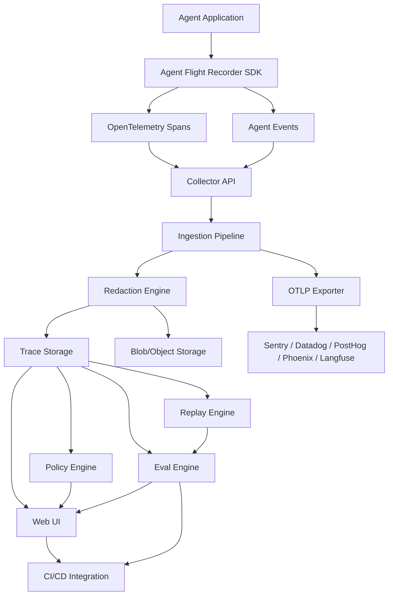
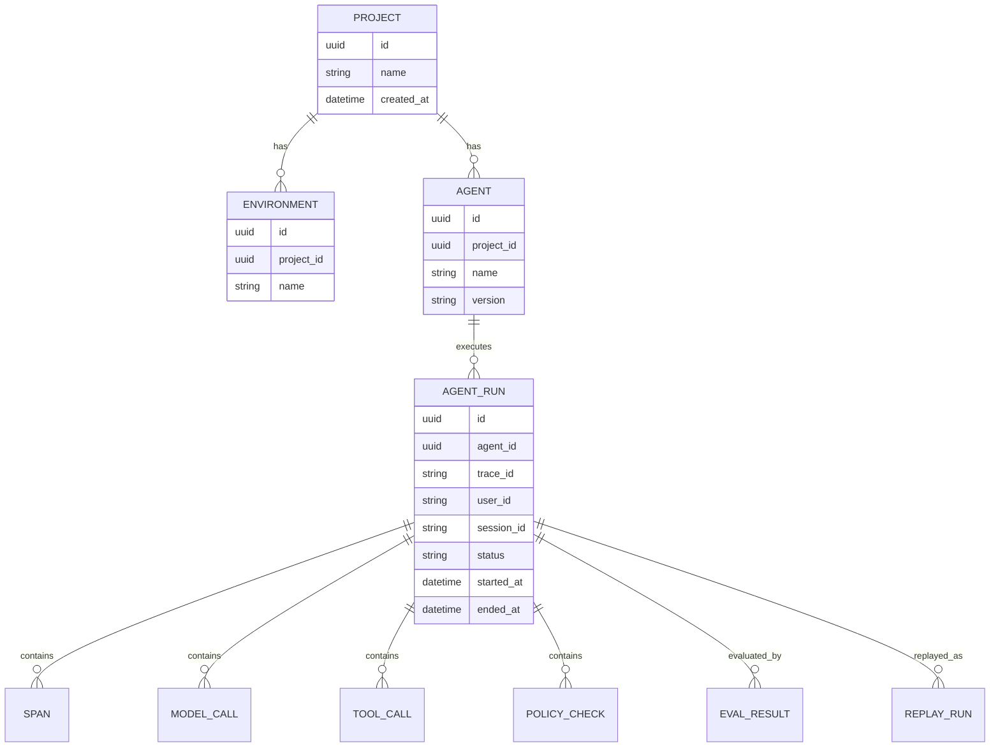

# Architecture

How Agent Flight Recorder is structured: OpenTelemetry as the base protocol, an agent-specific semantic layer on top, and components for ingestion, storage, replay, eval, and policy.

> Parent decision: [ADR-001](../adr/ADR-001-agent-flight-recorder.md)

## High-Level Architecture



## Core Decision: OpenTelemetry + Agent Semantics

OpenTelemetry provides traces, spans, attributes, events, collector compatibility, and vendor neutrality. Raw OTel alone is insufficient for agent reliability — replay, evals, and policy require richer structure.

**Agent span types:**

```text
agent.run
agent.step
llm.call
tool.call
retrieval.query
memory.read
memory.write
policy.check
human.approval
eval.run
replay.run
```

See [ADR-001 Section 8](../adr/ADR-001-agent-flight-recorder.md#8-core-architectural-decision) for rationale.

## Components

### SDKs (Python, TypeScript)

- Create OTel-compatible traces and agent-specific spans
- Capture runs, model calls, tool calls, retrieval, memory, errors, cost, latency
- Local buffering, retry, sampling, configurable redaction
- Environment-based config via `AFR_*` variables

### Collector API

Endpoints:

```text
POST /v1/traces
POST /v1/events
POST /v1/replays
POST /v1/evals
GET  /health
```

Also supports OTLP HTTP ingestion. Validates, normalizes, redacts, and routes to storage and exporters.

### Ingestion Pipeline

```text
Receive → validate → normalize → enrich → redact → classify risk → store → export
```

Enrichment may add model cost estimates, tool risk levels, deployment/git metadata, and error classification.

### Storage

| Mode | Backends |
|------|----------|
| **Local** | SQLite |
| **Production** | Postgres (metadata), ClickHouse (events/spans), object storage (large payloads) |

Details: [ADR-002](../adr/ADR-002-storage-strategy.md) (stub).

### Engines

- **Replay** — reproduce prior runs under controlled conditions ([replay.md](replay.md))
- **Eval** — score traces and replay results ([evals.md](evals.md))
- **Policy** — detect forbidden/risky behavior ([policies.md](policies.md))

## Data Model



Large payloads (prompts, tool I/O) are stored as blob references, not inline in relational/analytics stores.

## Event Taxonomy

Events follow a consistent `domain.action.status` pattern:

```text
agent.run.started / .completed / .failed
llm.call.started / .completed / .failed
tool.call.started / .completed / .failed
policy.check.started / .completed / .failed
replay.run.started / .completed / .failed
eval.run.started / .completed / .failed
```

Full list in [ADR-001 Section 11](../adr/ADR-001-agent-flight-recorder.md#11-agent-event-taxonomy).

## Technology Stack

| Layer | Choices |
|-------|---------|
| SDKs | Python, TypeScript, OpenTelemetry libraries |
| Backend | FastAPI or Node.js, background workers, OTLP HTTP |
| Storage (local) | SQLite |
| Storage (prod) | Postgres, ClickHouse, S3-compatible object storage |
| Frontend | Next.js, React, Tailwind, TanStack Query |
| Deployment | Docker Compose (local/self-hosted), Helm (later) |

## Related Docs

- [quickstart.md](quickstart.md) — get running in under five minutes
- [replay.md](replay.md) — replay modes and snapshots
- [evals.md](evals.md) — evaluation and regression testing
- [policies.md](policies.md) — policy engine and risk detection