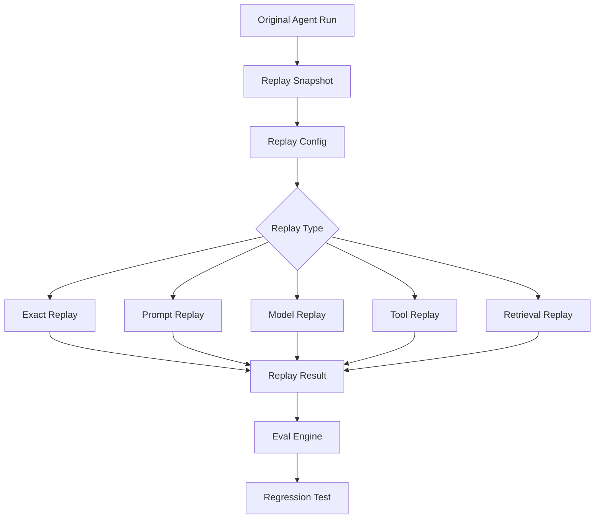

# Replay

Re-execute a previous agent run under controlled conditions — the core capability that turns production failures into debuggable, testable evidence.

> Parent decision: [ADR-001](../adr/ADR-001-agent-flight-recorder.md)

## Why Replay

Agent systems are non-deterministic. Replay lets you:

- Investigate exactly what happened in a production failure
- Compare behavior across prompt, model, or tool changes
- Feed results into the eval engine for regression testing

See [ADR-004](../adr/ADR-004-evaluation-regression.md) for how replay connects to CI gates.

## Replay Modes

| Mode | What changes | Use case |
|------|--------------|----------|
| **Exact** | Nothing (same input, prompt, model, tool responses) | Investigation |
| **Prompt** | Prompt only; same input and tool snapshots | Prompt iteration |
| **Model** | Model only; same input and prompt | Model comparison |
| **Tool** | Mocked or updated tool behavior | Tool regression testing |
| **Retrieval** | Retrieval configuration | RAG quality improvement |

## Replay Flow



## Replay Snapshot

A snapshot captures everything needed to reproduce a run:

- Original user input
- System and developer prompts
- Model configuration
- Tool definitions and recorded responses
- Retrieval results and memory state
- Agent and application version
- Timestamp and redaction metadata

Sensitive data is redacted or encrypted per project configuration. See [ADR-003](../adr/ADR-003-redaction-privacy.md).

## CLI (Phase 2)

```bash
# Replay with a different model
afr replay run_123 --model gpt-4.1-mini

# Run evals against replay result
afr eval run regression_refund_agent.yml

# Run full regression suite in CI
afr test ./afr-tests/
```

## UI Workflow

1. Open a failed agent run in the trace viewer
2. Click **Replay** and choose mode (exact, prompt, model, tool, retrieval)
3. Compare original vs. replay side-by-side
4. Review eval results and regression status
5. Export as a regression test for CI

## Mitigating Non-Determinism

Replay reliability is a known risk. Mitigations:

- Snapshot-based tool response mocking for tool replay mode
- Store retrieval results for retrieval replay
- Support partial replay of selected spans
- Flag replay runs where live tool responses diverge from snapshot

## Related Docs

- [evals.md](evals.md) — scoring replay results
- [policies.md](policies.md) — policy checks during replay
- [architecture.md](architecture.md) — replay engine in system context